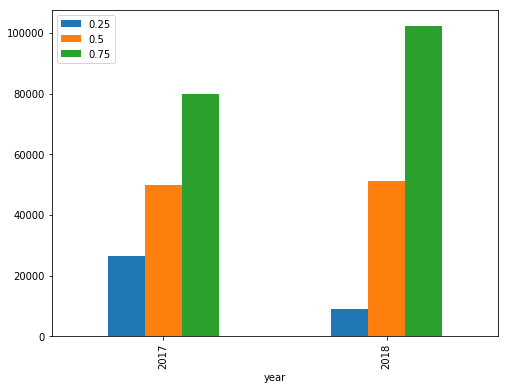
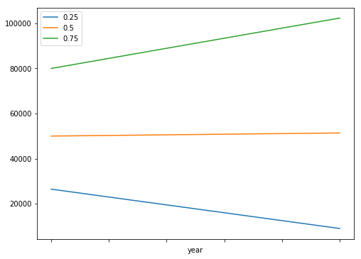
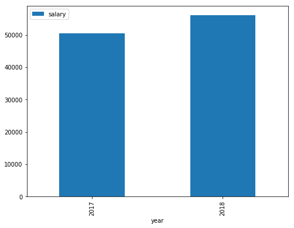
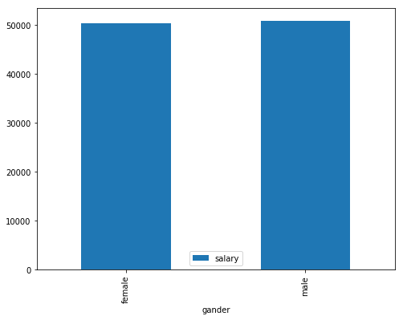
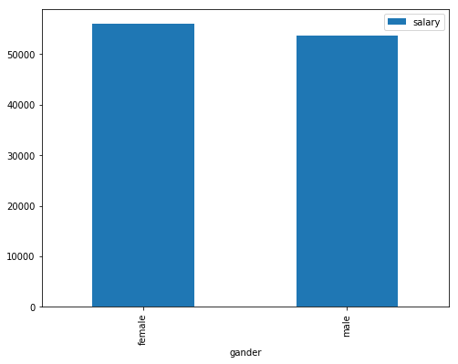

# Is the salary of female developers lower than that of male?

StackOverflow has published the results of their 2017 and 2018 Developer Survey. Let's take a look at the difference in wages between male and female developers in 2 years.We will investigate this issue in three steps.
## Question 1:Is wages increased?

 
The answer is very clear.Low-income developers’ wages fall.Middle-income developers are basically flat.High-income developer income has increased significantly.

## Question 2:Does female developer salary increase?

 
 We can see that the average annual income of female developers has increased by more than 11.2% this year.

## Question 3:Is women’s wages are higher than men’s?

2017

2018

 
Looking at the data from these two years,The average income of female developers is basically the same as that of men, but there is a slight overshoot.
 

Now we can answer the question of the title. The answer is direct negative.
